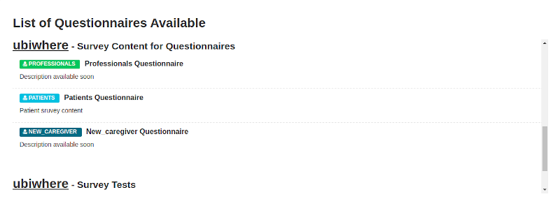

.. .. You should enable this project on travis-ci.org and coveralls.io to make
..    these badges work. The necessary Travis and Coverage config files have been
..    generated for you.

.. ..  image:: https://travis-ci.org/lsantos/ckanext-ext_v1.svg?branch=master
.. ..    :target: https://travis-ci.org/lsantos/ckanext-ext_v1

.. ..  image:: https://coveralls.io/repos/lsantos/ckanext-ext_v1/badge.svg
.. ..  :target: https://coveralls.io/r/lsantos/ckanext-ext_v1

.. ..  image:: https://pypip.in/download/ckanext-ext_v1/badge.svg
.. ..  :target: https://pypi.python.org/pypi//ckanext-ext_v1/
.. ..  :alt: Downloads

.. ..  image:: https://pypip.in/version/ckanext-ext_v1/badge.svg
.. ..  :target: https://pypi.python.org/pypi/ckanext-ext_v1/
.. ..  :alt: Latest Version

.. ..  image:: https://pypip.in/py_versions/ckanext-ext_v1/badge.svg
.. ..    :target: https://pypi.python.org/pypi/ckanext-ext_v1/
.. ..    :alt: Supported Python versions

.. ..  image:: https://pypip.in/status/ckanext-ext_v1/badge.svg
.. ..    :target: https://pypi.python.org/pypi/ckanext-ext_v1/
.. ..    :alt: Development Status

.. ..  image:: https://pypip.in/license/ckanext-ext_v1/badge.svg
.. ..    :target: https://pypi.python.org/pypi/ckanext-ext_v1/
.. ..    :alt: License

==============
ckanext-ext_v1
==============

Ext_v1 is the first version of an objective, efficient and usable CKAN extension, whose primary goal is to allow users to create and fill questionnaires. The questionnaire's data is stored to evaluate and collect more concise and precise results about the stakeholder's experience and end-user data. Due to the CKAN default structure, the platform easily integrates with the extension.

For instance, a registered user creates a specific organization and then adds several datasets to this organization. 
With this extension, each dataset created has a particular purpose (e.g. processing a survey template for questionnaire rendering, storing questionnaire responses, or storing user's background information) and tasks for the correct providing and collection of information in a secure way.

The questionnaires have to be uploaded into a specific platform's dataset, as explained further. Their data came from JSON files generated on an external website that handles standard survey generation for the web (https://surveyjs.io/Examples/Survey-Creator). This extension is responsible for getting the data and rendering structured and organized questionnaires. 

In short, using extras pair of key/values in the creation of new datasets, it is possible to define each dataset for a specific purpose.
For now, there are three types of keys:

- **is_data_store**: has the purpose of defining a dataset as a datastore to the questionnaires’ responses;

- **is_patient_store**: has the purpose of defining a dataset as a datastore to the uploaded patients files;

- **is_templating**:has the purpose of defining a dataset as a survey datastore.

*Note: when creating new datasets, add the key into 'Custom Field' input. 
You can only use one for each dataset.*

**is_data_store**

Datasets with this extra field will store data gathered from questionnaire filling.
Each questionnaire response is associated with a record and can be visualized by entering the resource and searching by id, username, questions, or answers. All the resources can be automatically created, depending on the name of the questionnaire that it is associated with. In the following image, it is possible to see an example of a record and all the data recorded.

*Note: all questions and consequent responses are stored*

**is_patient_store**

With this key, a dataset is defined as a store to upload files with information from 
patients. For now, we only test one example (SKBA example file) and, although the data 
visualization is incorrect (rows and columns do not match), the information is well 
recognized. 

It is important to refer that this dataset can only create one resource per patient. 

**is_templating**

To be able to list questionnaires in CKAN must be created a new dataset with this extra field. 
Consequently, the resources within this type of dataset are associated with the questionnaire rendering.

For instance, if a user wants to add a new questionnaire for a certain community, it is mandatory to create a new resource in the templating's dataset. Only then a JSON file, with the questionnaire's structure, can be uploaded to that resource (to be processed by the extension).

The following image presents an example of a structure associated with a resource of this type of dataset.

*Note: You can choose which datasets are private or public to the organization or all platform.*

--------------------
Create Questionnaire
--------------------

The data from the JSON files uploaded to CKAN for questionnaire rendering is generated on an external website. To facilitate the perception and understanding of this process, we will explain, step by step, what must be done.

**SurveyJS** is an online visual survey creator and form builder that offers exactly what we want.

The structure used in the website is what the extension will try to understand to render it in an efficient and organized way. Therefore, a default structure is defined, where some pages and corresponding properties are mandatory to avoid malformed questionnaires.

1. Go to https://surveyjs.io/Examples/Survey-Creator#content-result and, using the survey design, you can start creating the questionnaire.

2. Change the page properties to create an introduction page (title, name, description).

3. Create the right components to the introduction page (*Component* objects).

4. Add new pages to fill them with questions.

5. All the questions must be inside a *Panel* object. After inserting one or several *Panels* there are two types of questions that our extension accepts:

     * radiogroup: To add it into the questionnaire, simply choose the tool ‘RadioGroup’ and click or drag it into the panel. It is possible to change the order of the questions by dragging them up and down. Having the object in the survey design and inside a panel, click on it and go to ‘Properties’. There you can define the default fields of a question (here the ‘Description’ field is ignored) and then you can define if it is required or not. By activating the field ‘Is required’ our extension will assume the obligation and the user will have to answer it. Having the question text, we need to configure the possible answers. For that, we need to go to ‘Choices’, a dropdown button in the ‘Properties’ area. It contains the default key/values generated by the website and they are the fields that we must change. It is possible to erase and add options and change their values. For a correct definition of each option, the following steps must be followed:

          * change the ‘Text’ input to the value that will appear in the question as possible options;
          
          * change the ‘Value’ input with a snake case style (p.e not_at_all ). It is the same as the ‘Text’ input but converted into a snake case.

     * single input: It is the classic type of question where the user needs to write his answer. To add it, choose the tool ‘Single input’ (it is also possible to order it). The rules are the same as for the radiogroup questions but in this case, there are no choices and it is possible to write a placeholder.

6. Finishing the questionnaire pages and having prepared the introduction page as well, the questionnaire is complete. Now we need to be able to access the raw data and then export it. For that, SurveyJS provides a JSON Editor. It is a tab that enables the visualization of questionnaire raw data. It provides the information in JSON format. To be able to export this data, this tab has several buttons with different actions. By clicking on the ‘Copy’ button, all the data is copied.

7. Once all the necessary data has been copied from the JSON Editor, the next step is to save it in a local file. To do it, use a text editor. Open a new file,  paste all the data and then save it as a JSON file. The file must be saved in JSON format (p.e patients.json).

8. It is just necessary to create a new resource in a templating dataset and upload the JSON file to CKAN.

9. In CKAN, we provide an example JSON file that contains SurveyJS generated data and that can be imported into the website and then changed to the creators’ requirements.

--------------------
Submit Questionnaire
--------------------

Having questionnaires already on the platform, ‘ext_v1’ has the permissions to list all of them on the main page. Since each organization can have several templating datasets, each one labeled with the name of the organization followed by the title of the dataset.
In the image below, we can see part of the questionnaires and the general associated information.

---------------
Important rules
---------------

The following points are the rules and features that need to be followed for our extension to work efficiently:
* To create an organization, you need to be a registered user;

* We use Keycloak as an external server for the authentication process, so every user has to be registered there, and the login is done in it as well;

* Only admin and editors’ users  can create new datasets and resources;

* If a templating dataset is public, users from all organizations and non-registered users can visualize it and answer it as well;

* If a templating dataset is private, only members from that organization have access to the questionnaires in the dataset. It is possible to add specific members as well by writing  the username on the ‘Add Member’ page;

* Datasets, that store questionnaires’ responses (is_data_store), are automatically created;

* Questionnaires that do not respect the default rules will return error messages to the final user. In that case, export the JSON data to SurveyJS and review it;

* An alert is displayed if a user does not answer all the required questions;

* Try to give simple identifiers/names to the questionnaires’ files to get cleaner and more objective words in the questionnaires list.

============
Requirements
============

It was successfully tested and integrated into CKAN 2.8 version. The remaining available versions weren't, which it's not completely safe to use them.

============
Installation
============

- To install ckanext-ext_v1 in a set of Docker images and configuration files to run a CKAN site (https://github.com/okfn/docker-ckan):

     1. Go to Dockerfile in ckan folder ``/ckan/Dockerfile`` and add::

          RUN pip install -e git+https://gitlab.ubiwhere.com/smart-cities-h2020/tenderhealth/ckan-custom-forms.git@master#egg=ckanext-ext_v1

     2. Add the plugin ``ext_v1`` to the ``ckan.plugins`` setting in your CKAN config file

     3. Run or Restart CKAN container::

          docker container start/restart <name_of_ckan_container>

- To install ckanext-ext_v1 on local CKAN project:

     1. Activate your CKAN virtual environment, for example::

          . /usr/lib/ckan/default/bin/activate

     2. Install the ckanext-ext_v1 Python package into your virtual environment::

          pip install ckanext-ext_v1

     3. Add ``ext_v1`` to the ``ckan.plugins`` setting in your CKAN config file (by default the config file is located at ``/etc/ckan/default/production.ini``).

     4. Restart CKAN. For example if you've deployed CKAN with Apache on Ubuntu::

          sudo service apache2 reload

========================
Development Installation
========================

To install ckanext-ext_v1 for development, activate your CKAN virtualenv and
do::

    git clone https://github.com/lsantos/ckanext-ext_v1.git
    cd ckanext-ext_v1
    python setup.py develop
    pip install -r dev-requirements.txt

